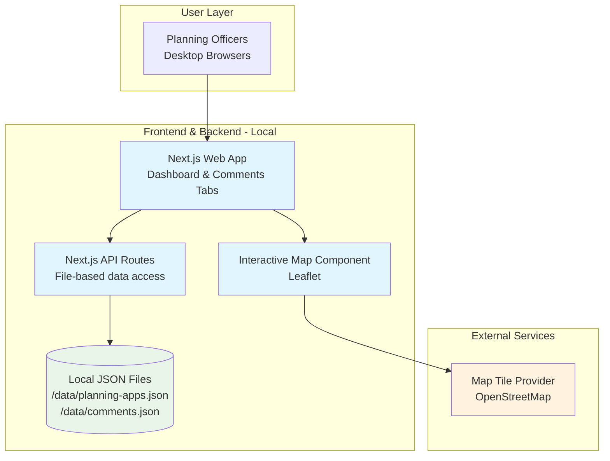
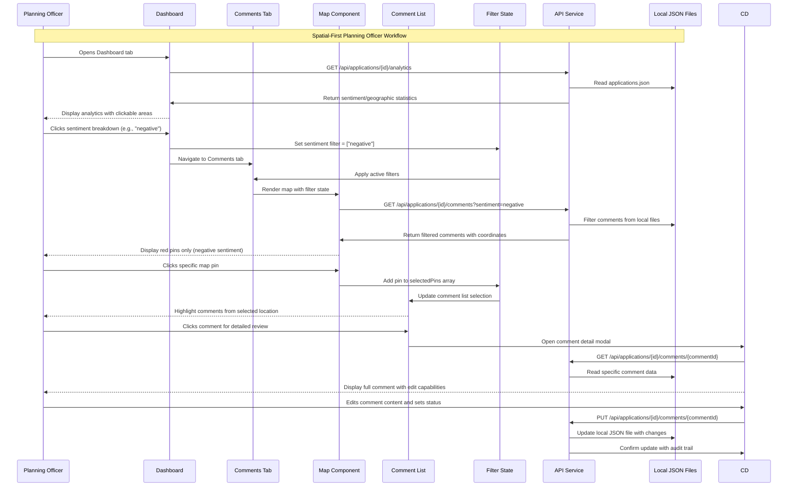
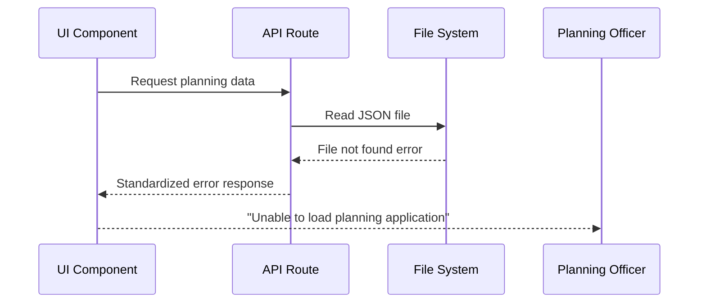

# UK Planning Officer Neighbor Response Web App Fullstack Architecture Document

This document outlines the complete fullstack architecture for **UK Planning Officer Neighbor Response Web App**, including backend systems, frontend implementation, and their integration. It serves as the single source of truth for AI-driven development, ensuring consistency across the entire technology stack.

This unified approach combines what would traditionally be separate backend and frontend architecture documents, streamlining the development process for modern fullstack applications where these concerns are increasingly intertwined.

## Introduction

### Starter Template or Existing Project

Based on the PRD technical assumptions, this is a **greenfield project** with specific technology preferences:

**PRD-Specified Stack:**
- Next.js 14+ with TypeScript
- Shadcn UI component library  
- Leaflet/Mapbox for mapping
- Node.js/Express backend
- Local file-based storage
- Monorepo structure (`/frontend`, `/backend`, `/shared`)

**Template Recommendation:**
Consider the **T3 Stack** or **Next.js + tRPC starter** as potential foundations, offering:
- Next.js 14+ with TypeScript pre-configured
- tRPC for type-safe APIs (could replace REST)
- Monorepo-friendly structure
- Local development optimization

However, given the specific mapping requirements and custom workflow needs, a **custom setup** may provide better control over the spatial-first architecture requirements.

**Decision:** Custom Next.js setup to maintain full control over mapping integrations and planning officer workflow optimizations.

### Change Log

| Date | Version | Description | Author |
|------|---------|-------------|--------|
| 2025-08-06 | 1.0 | Initial architecture document creation | Winston (Architect) |

## High Level Architecture

### Technical Summary

The UK Planning Officer Neighbor Response Web App employs a **spatial-first fullstack architecture** built on Next.js 14+ with TypeScript, featuring a dual-tab interface optimized for planning officer workflows. The frontend leverages interactive mapping (Leaflet/Mapbox) as the primary navigation paradigm with real-time bi-directional synchronization between color-coded sentiment pins and filterable comment lists. The backend utilizes **file-based JSON data storage** with Next.js API routes serving geographic data and neighbor comments from editable local files, enabling rapid prototyping and easy data modification during development. **Local hosting** provides complete control over the development environment, while the **monorepo structure** ensures type-safe data consistency across spatial coordinate handling and planning workflow state management.

### Platform and Infrastructure Choice

For a **file-based prototype** with maximum development speed and data editability:

**Platform:** Local Development Environment (Next.js dev server)  
**Key Services:** Next.js (Frontend + API routes), Map tile provider (OpenStreetMap)  
**Deployment Host and Regions:** Local development server (localhost:3000), no external services required  
**Data Storage:** Local JSON files in `/data` directory, editable and version-controlled with the project

### Repository Structure

**Structure:** Simplified monorepo optimized for file-based prototype  
**Monorepo Tool:** npm workspaces (lightweight for prototype)  
**Package Organization:**
- `/apps/web` - Next.js application with API routes
- `/packages/shared` - TypeScript interfaces for planning data
- `/packages/ui` - Shadcn UI components  
- `/data` - **Editable JSON files** containing mock planning data
- `/packages/config` - Shared tooling configuration

### High Level Architecture Diagram



### Architectural Patterns

- **File-Based Data Layer:** JSON files as single source of truth with TypeScript interfaces - _Rationale:_ Maximum prototype flexibility, easy data editing during development, version-controlled test scenarios
- **Serverless API Routes:** Next.js API routes for file reading/writing operations - _Rationale:_ Eliminates external database complexity while maintaining API abstraction for future database migration
- **Static Site Generation + Dynamic APIs:** Static pages with dynamic data loading from local files - _Rationale:_ Fast loading times with editable data during development phase
- **In-Memory Caching:** File system caching for frequently accessed planning data - _Rationale:_ Maintains performance targets (sub-2 second loads) despite file-based approach
- **Spatial-First Navigation:** Interactive map as primary UI paradigm - _Rationale:_ Core PRD requirement unchanged by data storage approach
- **Bi-Directional Data Binding:** Real-time map-list synchronization via React state - _Rationale:_ Critical planning officer workflow requirement independent of backend architecture

## Tech Stack

This is the DEFINITIVE technology selection for the entire project. This table serves as the single source of truth - all development must use these exact versions and approaches.

### Technology Stack Table

| Category | Technology | Version | Purpose | Rationale |
|----------|------------|---------|---------|-----------|
| Frontend Language | TypeScript | 5.3+ | Type-safe development across spatial data handling | Essential for complex geographic coordinate interfaces and planning data schemas |
| Frontend Framework | Next.js | 14+ | React-based fullstack framework with API routes | PRD requirement + built-in API routes eliminate need for separate backend server |
| UI Component Library | Shadcn UI | Latest | Professional planning department interface components | PRD requirement + consistent government application styling |
| State Management | React Context + useReducer | React 18+ | Bi-directional map-list synchronization | Complex spatial filtering state requires centralized management without external dependencies |
| Backend Language | TypeScript | 5.3+ | Consistent language across stack | Shared planning data interfaces between frontend/backend |
| Backend Framework | Next.js API Routes | 14+ | Serverless API endpoints for file operations | Simplified architecture - no separate server needed for prototype |
| API Style | REST | - | Standard HTTP endpoints for planning data | Simple, well-understood for prototype with clear migration path |
| Database | JSON Files | - | Local file storage for planning/comment data | Prototype requirement - editable, version-controlled mock data |
| Cache | Node.js fs caching | - | In-memory file caching for performance | Meet sub-2 second load time requirements |
| File Storage | Local filesystem | - | Planning documents and data files | Prototype simplicity + version control integration |
| Authentication | None (Prototype) | - | Skip auth for prototype validation | Focus on core spatial workflows first |
| Frontend Testing | Vitest + Testing Library | Latest | Fast unit/integration tests for map components | Better performance than Jest for Vite-based testing |
| Backend Testing | Vitest | Latest | API route testing for file operations | Consistent testing framework across stack |
| E2E Testing | Playwright | Latest | Critical spatial workflow validation | PRD requires map interaction testing - Playwright handles complex DOM |
| Build Tool | Vite (via Next.js) | Latest | Fast development builds | Next.js 14+ uses Turbopack/Vite for optimal dev experience |
| Bundler | Next.js bundler | 14+ | Production optimization with tree shaking | Built-in optimization for React + mapping libraries |
| IaC Tool | None (Prototype) | - | Skip infrastructure as code | Local development only, no infrastructure to manage |
| CI/CD | None (Prototype) | - | Local development workflow | No deployment pipeline needed for prototype |
| Monitoring | Console logging | - | Basic development monitoring | Console-based logging sufficient for prototype validation |
| Logging | Console + local files | - | Development and error logging | Local logging sufficient for prototype development |
| CSS Framework | Tailwind CSS | 4.1+ | Utility-first styling with Shadcn UI | Latest features and performance improvements with Shadcn UI integration |
| Mapping Library | Leaflet | 1.9+ | Interactive map with custom pin rendering | Lightweight, flexible for complex spatial interactions vs Mapbox complexity |
| Map Tiles | OpenStreetMap | - | Free map tiles for UK planning data | No API keys required, suitable for government prototype |

## Data Models

Based on the PRD requirements for UK planning officer workflows, I'll define the core data models that enable spatial-first navigation and bi-directional map-list synchronization.

### PlanningApplication

**Purpose:** Represents a UK planning application with associated neighbor responses and geographic context

**Key Attributes:**
- id: string - Unique application identifier (e.g., "APP/2024/0123")
- reference: string - Planning authority reference number
- address: string - Application site address
- description: string - Development description
- applicantName: string - Applicant name
- submissionDate: Date - Application submission date
- coordinates: GeographicCoordinate - Application site location
- status: ApplicationStatus - Current application status
- comments: NeighborComment[] - Array of neighbor responses

#### TypeScript Interface
```typescript
interface PlanningApplication {
  id: string;
  reference: string;
  address: string;
  description: string;
  applicantName: string;
  submissionDate: Date;
  coordinates: GeographicCoordinate;
  status: ApplicationStatus;
  comments: NeighborComment[];
  createdAt: Date;
  updatedAt: Date;
}

type ApplicationStatus = 'submitted' | 'under_review' | 'consultation' | 'decision_pending' | 'approved' | 'refused';
```

#### Relationships
- Has many NeighborComment entities (one-to-many)
- Contains GeographicCoordinate for spatial positioning

### NeighborComment

**Purpose:** Individual neighbor response with sentiment analysis and geographic location for spatial filtering

**Key Attributes:**
- id: string - Unique comment identifier
- applicationId: string - Reference to parent planning application
- neighborAddress: string - Commenting neighbor's address
- coordinates: GeographicCoordinate - Neighbor location for map pin positioning
- content: string - Full comment text
- sentiment: SentimentType - Color-coded sentiment classification
- submissionDate: Date - Comment submission timestamp
- status: CommentStatus - Publication/review status
- officerNotes: string - Planning officer annotations
- isEdited: boolean - Tracks officer modifications

#### TypeScript Interface
```typescript
interface NeighborComment {
  id: string;
  applicationId: string;
  neighborAddress: string;
  coordinates: GeographicCoordinate;
  content: string;
  sentiment: SentimentType;
  submissionDate: Date;
  status: CommentStatus;
  officerNotes?: string;
  isEdited: boolean;
  originalContent?: string; // Audit trail for edits
  createdAt: Date;
  updatedAt: Date;
}

type SentimentType = 'positive' | 'neutral' | 'negative';
type CommentStatus = 'pending_review' | 'approved_for_publication' | 'confidential' | 'redacted';
```

#### Relationships
- Belongs to PlanningApplication (many-to-one)
- Contains GeographicCoordinate for map pin rendering

### GeographicCoordinate

**Purpose:** Standardized geographic positioning for UK planning context with spatial query support

**Key Attributes:**
- latitude: number - Decimal degrees latitude (UK range: ~49.8 to 60.9)
- longitude: number - Decimal degrees longitude (UK range: ~-8.2 to 1.8)
- precision: number - Coordinate accuracy in meters
- source: string - Data source (e.g., "postcode_lookup", "manual_entry")

#### TypeScript Interface
```typescript
interface GeographicCoordinate {
  latitude: number;
  longitude: number;
  precision?: number;
  source?: string;
}
```

#### Relationships
- Used by PlanningApplication for site location
- Used by NeighborComment for neighbor positioning

### FilterState

**Purpose:** Centralized state management for bi-directional map-list synchronization and cross-tab navigation

**Key Attributes:**
- selectedPins: string[] - Array of selected neighbor comment IDs
- sentimentFilter: SentimentType[] - Active sentiment filters
- statusFilter: CommentStatus[] - Publication status filters
- searchQuery: string - Text search within comments
- activeApplication: string - Currently viewed application ID
- mapBounds: MapBounds - Current map viewport
- isDashboardFiltered: boolean - Indicates Dashboard drill-down active

#### TypeScript Interface
```typescript
interface FilterState {
  selectedPins: string[];
  sentimentFilter: SentimentType[];
  statusFilter: CommentStatus[];
  searchQuery: string;
  activeApplication: string;
  mapBounds?: MapBounds;
  isDashboardFiltered: boolean;
}

interface MapBounds {
  northEast: GeographicCoordinate;
  southWest: GeographicCoordinate;
}
```

#### Relationships
- References NeighborComment IDs for pin selection
- Coordinates with PlanningApplication for application context

## API Specification

Based on the REST API style selected in the Tech Stack and the **local-only file-based prototype** approach, here's the API specification:

### REST API Specification (Local Development)

```yaml
openapi: 3.0.0
info:
  title: UK Planning Officer Neighbor Response API
  version: 1.0.0
  description: RESTful API for spatial-first planning officer workflows with local file-based storage
servers:
  - url: http://localhost:3000/api
    description: Local development server (Next.js dev server)

paths:
  /applications:
    get:
      summary: Get all planning applications from local JSON files
      tags: [Applications]
      responses:
        '200':
          description: List of planning applications from /data/applications.json
          content:
            application/json:
              schema:
                type: array
                items:
                  $ref: '#/components/schemas/PlanningApplicationSummary'

  /applications/{applicationId}:
    get:
      summary: Get specific planning application with comments from local files
      tags: [Applications]
      parameters:
        - name: applicationId
          in: path
          required: true
          schema:
            type: string
          example: "APP/2024/0123"
      responses:
        '200':
          description: Complete planning application data from local JSON
          content:
            application/json:
              schema:
                $ref: '#/components/schemas/PlanningApplication'

  /applications/{applicationId}/comments:
    get:
      summary: Get filtered comments from local JSON with spatial filtering
      tags: [Comments]
      parameters:
        - name: applicationId
          in: path
          required: true
          schema:
            type: string
        - name: sentiment
          in: query
          schema:
            type: array
            items:
              type: string
              enum: [positive, neutral, negative]
        - name: bounds
          in: query
          schema:
            type: string
          description: Geographic bounds (lat1,lng1,lat2,lng2)
      responses:
        '200':
          description: Comments filtered from local JSON data

  /applications/{applicationId}/comments/{commentId}:
    put:
      summary: Update comment in local JSON files
      tags: [Comments]
      requestBody:
        required: true
        content:
          application/json:
            schema:
              type: object
              properties:
                content:
                  type: string
                status:
                  type: string
                  enum: [pending_review, approved_for_publication, confidential, redacted]
                officerNotes:
                  type: string

  /applications/{applicationId}/analytics:
    get:
      summary: Get dashboard analytics calculated from local JSON data
      tags: [Analytics]
      responses:
        '200':
          description: Analytics calculated from local data files

components:
  schemas:
    GeographicCoordinate:
      type: object
      required: [latitude, longitude]
      properties:
        latitude:
          type: number
          minimum: 49.8
          maximum: 60.9
        longitude:
          type: number
          minimum: -8.2
          maximum: 1.8
        precision:
          type: number
        source:
          type: string

    PlanningApplication:
      type: object
      required: [id, reference, address, description, status, coordinates]
      properties:
        id:
          type: string
        reference:
          type: string
        address:
          type: string
        description:
          type: string
        applicantName:
          type: string
        coordinates:
          $ref: '#/components/schemas/GeographicCoordinate'
        status:
          type: string
          enum: [submitted, under_review, consultation, decision_pending, approved, refused]
        comments:
          type: array
          items:
            $ref: '#/components/schemas/NeighborComment'

    NeighborComment:
      type: object
      properties:
        id:
          type: string
        applicationId:
          type: string
        neighborAddress:
          type: string
        coordinates:
          $ref: '#/components/schemas/GeographicCoordinate'
        content:
          type: string
        sentiment:
          type: string
          enum: [positive, neutral, negative]
        status:
          type: string
          enum: [pending_review, approved_for_publication, confidential, redacted]
        officerNotes:
          type: string
        isEdited:
          type: boolean
```

## Components

### WebApp (Next.js Frontend Application)

**Responsibility:** Main application shell providing tab-based navigation and spatial-first user interface for planning officers

**Key Interfaces:**
- Dashboard tab with analytics overview and drill-down navigation
- Comments tab with interactive map and synchronized comment list
- Responsive layout optimized for desktop planning workflows

**Dependencies:** MapComponent, CommentList, Analytics, FilterState management

**Technology Stack:** Next.js 14+, TypeScript, Shadcn UI, Tailwind CSS 4.1+, React Context for state management

### MapComponent (Interactive Spatial Interface)

**Responsibility:** Renders interactive Leaflet map with color-coded neighbor sentiment pins and handles spatial selection events

**Key Interfaces:**
- Pin rendering with sentiment-based color coding (red/yellow/green)
- Click event handling for pin selection and geographic filtering
- Bi-directional synchronization with comment list selections
- Map bounds change events for viewport-based filtering

**Dependencies:** Leaflet library, OpenStreetMap tiles, GeographicCoordinate data, FilterState

**Technology Stack:** React + Leaflet, TypeScript interfaces for geographic data, custom pin styling

### CommentList (Synchronized Data Display)

**Responsibility:** Displays filterable neighbor comments with real-time synchronization to map pin selections

**Key Interfaces:**
- Comment rendering with address, sentiment indicators, and excerpts
- Filter state updates from map pin selections
- Individual comment selection highlighting corresponding map pins
- Comment detail modal access and editing capabilities

**Dependencies:** FilterState, NeighborComment data model, CommentDetail component

**Technology Stack:** React components with Shadcn UI, virtualization for performance, TypeScript

### FilterState (Centralized State Management)

**Responsibility:** Manages bi-directional synchronization between map interactions, comment list filtering, and cross-tab navigation state

**Key Interfaces:**
- Pin selection state management and persistence
- Filter application for sentiment, status, and geographic bounds
- Cross-tab filter state preservation for Dashboard drill-down
- URL state synchronization for bookmarking filtered views

**Dependencies:** React Context, localStorage for persistence, URL routing integration

**Technology Stack:** React Context + useReducer, TypeScript state interfaces, Next.js router integration

### APIService (File-Based Data Layer)

**Responsibility:** Handles all data operations through Next.js API routes reading/writing local JSON files

**Key Interfaces:**
- Application data loading from /data/applications.json
- Comment filtering and CRUD operations
- Analytics calculation for Dashboard statistics
- File system operations with error handling and caching

**Dependencies:** Node.js fs module, JSON file parsing, TypeScript data models

**Technology Stack:** Next.js API routes, Node.js file operations, in-memory caching, TypeScript

## External APIs

For this local-only prototype, external API integrations are minimal:

### OpenStreetMap Tile API

- **Purpose:** Provides map tile images for Leaflet map rendering in UK planning context
- **Documentation:** https://wiki.openstreetmap.org/wiki/Tile_servers
- **Base URL(s):** https://tile.openstreetmap.org/{z}/{x}/{y}.png
- **Authentication:** None required (free tile service)
- **Rate Limits:** Fair use policy - adequate for prototype development

## Core Workflows



## Database Schema

Since we're using local JSON files, here's the file-based data structure:

### File Organization Structure

```json
/data/
├── applications.json          // Main planning applications data
└── sample-scenarios/          // Alternative test scenarios
```

### Primary Schema: applications.json

```json
{
  "applications": [
    {
      "id": "APP/2024/0123",
      "reference": "APP/2024/0123", 
      "address": "45 Victoria Street, Manchester M1 2EQ",
      "description": "Two-storey rear extension",
      "applicantName": "John Smith",
      "submissionDate": "2024-07-15T09:00:00Z",
      "coordinates": {
        "latitude": 53.4808,
        "longitude": -2.2426,
        "precision": 10,
        "source": "postcode_lookup"
      },
      "status": "consultation",
      "createdAt": "2024-07-15T09:00:00Z",
      "updatedAt": "2024-07-20T14:30:00Z",
      "comments": [
        {
          "id": "comment_001",
          "applicationId": "APP/2024/0123",
          "neighborAddress": "47 Victoria Street, Manchester M1 2EQ",
          "coordinates": {
            "latitude": 53.4810,
            "longitude": -2.2428,
            "precision": 5,
            "source": "postcode_lookup"
          },
          "content": "I strongly object to this development as it will significantly reduce natural light to our property.",
          "sentiment": "negative",
          "submissionDate": "2024-07-18T16:45:00Z",
          "status": "pending_review",
          "officerNotes": "",
          "isEdited": false,
          "originalContent": null,
          "createdAt": "2024-07-18T16:45:00Z",
          "updatedAt": "2024-07-18T16:45:00Z"
        }
      ]
    }
  ]
}
```

## Frontend Architecture

### Component Architecture

#### Component Organization
```
/src/
├── components/
│   ├── ui/                    // Shadcn UI base components
│   ├── layout/
│   │   ├── AppLayout.tsx      // Main application shell
│   │   └── TabNavigation.tsx  // Dashboard/Comments tab switching
│   ├── dashboard/
│   │   ├── Analytics.tsx      // Statistics display with drill-down
│   │   └── StatCard.tsx       // Individual statistic components
│   ├── map/
│   │   ├── MapComponent.tsx   // Main Leaflet map container
│   │   ├── CommentPin.tsx     // Individual map pins with sentiment colors
│   │   └── MapControls.tsx    // Zoom, center, filter controls
│   ├── comments/
│   │   ├── CommentList.tsx    // Synchronized comment display
│   │   ├── CommentItem.tsx    // Individual comment entries
│   │   ├── CommentDetail.tsx  // Modal for detailed comment view
│   │   └── CommentEditor.tsx  // Text editing with officer notes
│   └── filters/
│       ├── FilterBar.tsx      // Filter controls and indicators
│       └── FilterState.tsx    // State management hooks
```

#### Component Template
```typescript
// Example: CommentPin.tsx
import React from 'react';
import { NeighborComment } from '@/packages/shared/types';

interface CommentPinProps {
  comment: NeighborComment;
  isSelected: boolean;
  onPinClick: (commentId: string) => void;
  onPinHover: (commentId: string | null) => void;
}

export const CommentPin: React.FC<CommentPinProps> = ({
  comment,
  isSelected,
  onPinClick,
  onPinHover
}) => {
  const getSentimentColor = (sentiment: string) => {
    switch (sentiment) {
      case 'positive': return '#22c55e'; // green
      case 'negative': return '#ef4444'; // red  
      case 'neutral': return '#eab308';  // yellow
      default: return '#6b7280'; // gray
    }
  };

  return (
    <div
      className={`comment-pin ${isSelected ? 'selected' : ''}`}
      style={{ 
        backgroundColor: getSentimentColor(comment.sentiment),
        border: isSelected ? '3px solid #1d4ed8' : 'none'
      }}
      onClick={() => onPinClick(comment.id)}
      onMouseEnter={() => onPinHover(comment.id)}
      onMouseLeave={() => onPinHover(null)}
    >
      {/* Pin visual representation */}
    </div>
  );
};
```

### State Management Architecture

#### State Structure
```typescript
// FilterState context structure
interface FilterStateContext {
  selectedPins: string[];
  sentimentFilter: SentimentType[];
  statusFilter: CommentStatus[];
  searchQuery: string;
  geographicBounds: MapBounds | null;
  activeApplication: string;
  isDashboardFiltered: boolean;
  selectedComment: string | null;
}

// State management actions
type FilterAction = 
  | { type: 'SELECT_PIN'; commentId: string }
  | { type: 'SET_SENTIMENT_FILTER'; sentiments: SentimentType[] }
  | { type: 'SET_GEOGRAPHIC_BOUNDS'; bounds: MapBounds }
  | { type: 'CLEAR_ALL_FILTERS' };
```

### Routing Architecture

#### Route Organization
```
/src/pages/
├── index.tsx                  // Redirect to /dashboard
├── dashboard/
│   └── [applicationId].tsx    // Dashboard analytics view
├── comments/
│   └── [applicationId].tsx    // Comments tab with map and list
└── api/                       // Next.js API routes
    └── applications/
        ├── index.ts           // GET all applications
        ├── [id].ts           // GET specific application
        └── [id]/
            ├── comments.ts    // GET/POST comments with filtering
            └── analytics.ts   // GET dashboard statistics
```

### Frontend Services Layer

#### API Client Setup
```typescript
// /src/services/apiClient.ts
class PlanningAPIClient {
  private baseURL = '/api';
  
  async getApplication(id: string): Promise<PlanningApplication> {
    const response = await fetch(`${this.baseURL}/applications/${id}`);
    return response.json();
  }
  
  async getComments(
    applicationId: string, 
    filters: CommentFilters
  ): Promise<NeighborComment[]> {
    const queryParams = new URLSearchParams();
    if (filters.sentiment?.length) {
      queryParams.append('sentiment', filters.sentiment.join(','));
    }
    
    const response = await fetch(
      `${this.baseURL}/applications/${applicationId}/comments?${queryParams}`
    );
    return response.json();
  }
}

export const apiClient = new PlanningAPIClient();
```

## Backend Architecture

### Service Architecture

#### Function Organization
```
/src/pages/api/
├── applications/
│   ├── index.ts              // GET /api/applications
│   ├── [id].ts              // GET /api/applications/{id}
│   └── [id]/
│       ├── comments.ts       // GET/POST comments
│       ├── analytics.ts      // GET analytics  
│       └── comments/
│           └── [commentId].ts // PUT comment updates
└── utils/
    ├── fileOperations.ts     // Shared file I/O utilities
    └── errorHandling.ts      // Centralized error responses
```

#### Function Template
```typescript
// /src/pages/api/applications/[id]/comments.ts
import type { NextApiRequest, NextApiResponse } from 'next';
import { readApplicationData } from '../../../utils/fileOperations';

export default async function handler(
  req: NextApiRequest,
  res: NextApiResponse
) {
  const { id: applicationId } = req.query;
  
  try {
    switch (req.method) {
      case 'GET':
        return await getFilteredComments(req, res, applicationId as string);
      default:
        return res.status(405).json({ error: 'Method not allowed' });
    }
  } catch (error) {
    return res.status(500).json({ error: 'Internal server error' });
  }
}

async function getFilteredComments(
  req: NextApiRequest,
  res: NextApiResponse,
  applicationId: string
) {
  const filters = {
    sentiment: req.query.sentiment ? 
      (req.query.sentiment as string).split(',') : undefined,
    bounds: req.query.bounds ? 
      parseBounds(req.query.bounds as string) : undefined
  };
  
  const applicationData = await readApplicationData(applicationId);
  if (!applicationData) {
    return res.status(404).json({ error: 'Application not found' });
  }
  
  let filteredComments = applicationData.comments;
  
  if (filters.sentiment?.length) {
    filteredComments = filteredComments.filter(comment =>
      filters.sentiment!.includes(comment.sentiment)
    );
  }
  
  return res.status(200).json({
    comments: filteredComments,
    total: applicationData.comments.length,
    filtered: filteredComments.length
  });
}
```

### Database Architecture (File-Based)

#### Data Access Layer
```typescript
// /src/utils/fileOperations.ts
import fs from 'fs/promises';
import path from 'path';
import { PlanningApplication } from '@/packages/shared/types';

const DATA_DIR = path.join(process.cwd(), 'data');
const APPLICATIONS_FILE = path.join(DATA_DIR, 'applications.json');

// In-memory cache for performance
let applicationsCache: { data: PlanningApplication[]; lastModified: number } | null = null;

export async function readApplicationData(applicationId: string): Promise<PlanningApplication | null> {
  const applications = await getAllApplications();
  return applications.find(app => app.id === applicationId) || null;
}

export async function getAllApplications(): Promise<PlanningApplication[]> {
  try {
    const stats = await fs.stat(APPLICATIONS_FILE);
    const fileModified = stats.mtime.getTime();
    
    if (applicationsCache && applicationsCache.lastModified >= fileModified) {
      return applicationsCache.data;
    }
    
    const fileContent = await fs.readFile(APPLICATIONS_FILE, 'utf-8');
    const parsedData = JSON.parse(fileContent);
    
    applicationsCache = {
      data: parsedData.applications,
      lastModified: fileModified
    };
    
    return parsedData.applications;
  } catch (error) {
    console.error('Error reading applications data:', error);
    throw new Error('Failed to load planning applications');
  }
}

export async function writeApplicationData(
  applicationId: string, 
  updatedApplication: PlanningApplication
): Promise<void> {
  try {
    const applications = await getAllApplications();
    const index = applications.findIndex(app => app.id === applicationId);
    
    if (index === -1) {
      throw new Error('Application not found');
    }
    
    applications[index] = {
      ...updatedApplication,
      updatedAt: new Date().toISOString()
    };
    
    const fileContent = JSON.stringify({ applications }, null, 2);
    await fs.writeFile(APPLICATIONS_FILE, fileContent, 'utf-8');
    
    applicationsCache = null;
    
  } catch (error) {
    console.error('Error writing applications data:', error);
    throw new Error('Failed to update planning application');
  }
}
```

## Unified Project Structure

```
uk-planning-neighbor-responses/
├── apps/
│   └── web/                    # Main Next.js application
│       ├── src/
│       │   ├── components/     # React components
│       │   │   ├── ui/         # Shadcn UI components
│       │   │   ├── layout/     # App layout components
│       │   │   ├── dashboard/  # Dashboard-specific components
│       │   │   ├── map/        # Leaflet map components
│       │   │   ├── comments/   # Comment management components
│       │   │   └── filters/    # Filter state components
│       │   ├── pages/          # Next.js pages and API routes
│       │   │   ├── api/        # API endpoints
│       │   │   ├── dashboard/  # Dashboard pages
│       │   │   └── comments/   # Comments pages
│       │   ├── services/       # API client services
│       │   ├── context/        # React Context providers
│       │   ├── hooks/          # Custom React hooks
│       │   ├── utils/          # Frontend utilities
│       │   └── styles/         # Global styles
│       ├── public/             # Static assets
│       ├── data/               # **Local JSON data files**
│       │   ├── applications.json
│       │   └── sample-scenarios/
│       ├── tests/              # Tests
│       ├── package.json
│       └── next.config.js
├── packages/                   # Shared packages
│   ├── shared/                 # Shared TypeScript types
│   │   ├── src/
│   │   │   ├── types/          # Planning data interfaces
│   │   │   ├── constants/      # Shared constants
│   │   │   └── utils/          # Shared utilities
│   │   └── package.json
│   └── config/                 # Shared configuration
│       ├── eslint/
│       ├── typescript/
│       └── tailwind/
├── scripts/                    # Development scripts
├── docs/                       # Documentation
│   ├── prd.md
│   └── architecture.md        # This document
├── .env.example                # Environment template
├── package.json                # Root package.json
└── README.md
```

## Development Workflow

### Local Development Setup

#### Prerequisites
```bash
# Required software
node --version  # v18.17.0 or higher
npm --version   # v9.0.0 or higher
git --version   # v2.34.0 or higher
```

#### Initial Setup
```bash
# Clone repository
git clone <repository-url>
cd uk-planning-neighbor-responses

# Install dependencies
npm install

# Set up environment
cp .env.example .env.local

# Start development server
npm run dev
```

#### Development Commands
```bash
# Start development server
npm run dev

# Build for production testing
npm run build

# Run tests
npm run test           # All tests
npm run test:unit      # Unit tests only
npm run test:e2e       # E2E tests with Playwright

# Lint and format
npm run lint
npm run format
```

### Environment Configuration

#### Required Environment Variables
```bash
# Frontend (.env.local in apps/web)
NEXT_PUBLIC_MAP_TILES_URL=https://tile.openstreetmap.org/{z}/{x}/{y}.png
NEXT_PUBLIC_APP_ENV=development

# Shared
NODE_ENV=development
```

## Deployment Architecture

### Deployment Strategy

**Local Development Only:**
- **Platform:** Local Node.js development server
- **Build Command:** `npm run build` (for production testing)
- **Output Directory:** `apps/web/.next`
- **Data Storage:** Local JSON files in `apps/web/data/`

### Environments

| Environment | Frontend URL | Backend URL | Purpose |
|-------------|--------------|-------------|---------|
| Development | http://localhost:3000 | http://localhost:3000/api | Local development |

## Security and Performance

### Security Requirements

**Local Development Security:**
- **File Access:** Read/write permissions limited to data directory
- **Input Validation:** Comment content sanitization and length limits
- **XSS Prevention:** React's built-in JSX escaping

### Performance Optimization

**Local Performance Targets:**
- **Map Loading:** Sub-2 seconds for initial render
- **Filter Response:** <500ms for comment list updates
- **Pin Rendering:** Smooth interaction with 100+ pins
- **File I/O:** In-memory caching for JSON data

## Testing Strategy

### Testing Pyramid
```
               E2E Tests (Playwright)
              /                    \
         Integration Tests (Vitest)
        /                          \
   Frontend Unit Tests          API Route Tests
   (React Testing Library)      (Vitest)
```

### Test Organization

#### Frontend Tests
```
apps/web/tests/
├── components/           # Component unit tests
│   ├── map/
│   │   ├── MapComponent.test.tsx
│   │   └── CommentPin.test.tsx
│   └── comments/
│       └── CommentList.test.tsx
├── integration/          # Integration tests
│   └── map-comment-sync.test.tsx
└── e2e/                  # End-to-end tests
    ├── dashboard-workflow.spec.ts
    └── spatial-filtering.spec.ts
```

### Test Examples

#### Frontend Component Test
```typescript
import { render, fireEvent } from '@testing-library/react';
import { CommentPin } from '@/components/map/CommentPin';

describe('CommentPin', () => {
  it('renders with correct sentiment color', () => {
    const mockComment = {
      id: 'test-comment',
      sentiment: 'negative',
      coordinates: { latitude: 53.4808, longitude: -2.2426 }
    };

    const { container } = render(
      <CommentPin 
        comment={mockComment}
        isSelected={false}
        onPinClick={jest.fn()}
        onPinHover={jest.fn()}
      />
    );
    
    const pin = container.querySelector('.comment-pin');
    expect(pin).toHaveStyle('backgroundColor: #ef4444'); // red for negative
  });
});
```

#### E2E Test
```typescript
import { test, expect } from '@playwright/test';

test('map pin selection filters comment list', async ({ page }) => {
  await page.goto('/comments/APP/2024/0123');
  
  // Wait for map to load
  await page.waitForSelector('.leaflet-container');
  
  // Click on a map pin
  await page.click('[data-testid="comment-pin-negative"]');
  
  // Verify comment list is filtered
  const commentItems = page.locator('[data-testid="comment-item"]');
  await expect(commentItems).toHaveCount(5);
});
```

## Coding Standards

### Critical Fullstack Rules

- **Type Safety:** All geographic coordinates and planning data must use shared TypeScript interfaces from packages/shared
- **File Operations:** Never access JSON files directly - always use the fileOperations utility layer
- **State Management:** All filter state changes must go through the centralized FilterContext to maintain bi-directional synchronization
- **Error Boundaries:** Every major component (Map, CommentList, Dashboard) must have error boundary wrapping
- **Map Performance:** Pin components must be memoized and use stable keys to prevent unnecessary re-renders
- **Audit Compliance:** Comment updates must preserve originalContent and set isEdited flags for planning authority compliance

### Naming Conventions

| Element | Frontend | Backend | Example |
|---------|----------|---------|---------|
| Components | PascalCase | - | `MapComponent.tsx` |
| Hooks | camelCase with 'use' | - | `useFilterState.ts` |
| API Routes | kebab-case | - | `/api/applications` |
| JSON Properties | camelCase | camelCase | `neighborAddress` |

## Error Handling Strategy

### Error Flow


### Error Response Format
```typescript
interface ApiError {
  error: {
    code: string;
    message: string;
    details?: Record<string, any>;
    timestamp: string;
    requestId: string;
  };
}
```

### Frontend Error Handling
```typescript
export const SpatialErrorBoundary: React.FC<{ children: React.ReactNode }> = ({
  children
}) => {
  return (
    <ErrorBoundary
      fallback={<div>Map temporarily unavailable. Please refresh the page.</div>}
      onError={(error) => console.error('Spatial component error:', error)}
    >
      {children}
    </ErrorBoundary>
  );
};
```

### Backend Error Handling
```typescript
export function handleAPIError(error: any, res: NextApiResponse) {
  const errorResponse = {
    error: {
      code: error.code || 'INTERNAL_ERROR',
      message: error.message || 'An unexpected error occurred',
      timestamp: new Date().toISOString(),
      requestId: Math.random().toString(36)
    }
  };
  
  console.error('API Error:', errorResponse);
  return res.status(error.status || 500).json(errorResponse);
}
```

## Monitoring and Observability

### Monitoring Stack
- **Frontend Monitoring:** Browser console logging + local development tools
- **Backend Monitoring:** Node.js console output + file operation logging
- **Error Tracking:** Console-based error logging
- **Performance Monitoring:** Browser DevTools + Next.js built-in metrics

### Key Metrics

**Frontend Metrics:**
- Map load time and pin rendering performance
- Comment list filter response time
- User interaction success rate

**Backend Metrics:**
- File I/O operation duration
- API response times
- JSON file size and parse time

---

## Summary

This comprehensive fullstack architecture document provides the complete technical foundation for developing the UK Planning Officer Neighbor Response Web App as a **local-only, file-based prototype** using:

✅ **Next.js 14+ with TypeScript** for unified fullstack development  
✅ **Tailwind CSS 4.1+ and Shadcn UI** for professional planning interfaces  
✅ **Leaflet mapping** with spatial-first navigation paradigm  
✅ **Local JSON file storage** for rapid prototyping and data editability  
✅ **Bi-directional map-list synchronization** for planning officer workflows  
✅ **Performance-optimized** for sub-2 second loads and smooth pin interactions  
✅ **Comprehensive testing strategy** with unit, integration, and E2E coverage  

The architecture prioritizes development velocity and workflow validation while maintaining patterns suitable for future migration to production-grade databases and cloud deployment.