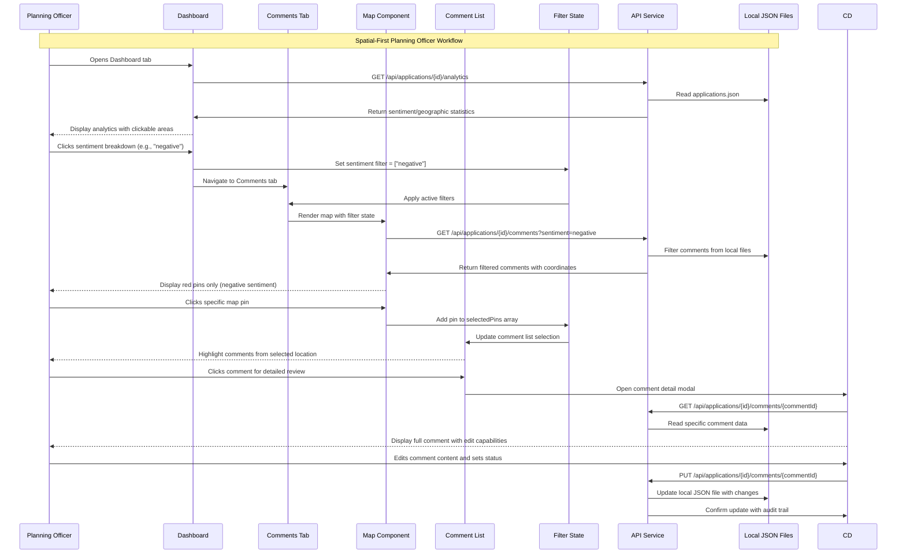

# Core Workflows

```mermaid
sequenceDiagram
    participant PO as Planning Officer
    participant DA as Dashboard
    participant CT as Comments Tab
    participant MC as Map Component
    participant CL as Comment List
    participant FS as Filter State
    participant API as API Service
    participant JSON as Local JSON Files

    Note over PO,JSON: Spatial-First Planning Officer Workflow

    PO->>DA: Opens Dashboard tab
    DA->>API: GET /api/applications/{id}/analytics
    API->>JSON: Read applications.json
    API->>DA: Return sentiment/geographic statistics
    DA-->>PO: Display analytics with clickable areas

    PO->>DA: Clicks sentiment breakdown (e.g., "negative")
    DA->>FS: Set sentiment filter = ["negative"]
    DA->>CT: Navigate to Comments tab
    FS->>CT: Apply active filters

    CT->>MC: Render map with filter state
    MC->>API: GET /api/applications/{id}/comments?sentiment=negative
    API->>JSON: Filter comments from local files
    API->>MC: Return filtered comments with coordinates
    MC-->>PO: Display red pins only (negative sentiment)

    PO->>MC: Clicks specific map pin
    MC->>FS: Add pin to selectedPins array
    FS->>CL: Update comment list selection
    CL-->>PO: Highlight comments from selected location

    PO->>CL: Clicks comment for detailed review
    CL->>CD: Open comment detail modal
    CD->>API: GET /api/applications/{id}/comments/{commentId}
    API->>JSON: Read specific comment data
    CD-->>PO: Display full comment with edit capabilities

    PO->>CD: Edits comment content and sets status
    CD->>API: PUT /api/applications/{id}/comments/{commentId}
    API->>JSON: Update local JSON file with changes
    API->>CD: Confirm update with audit trail
```
