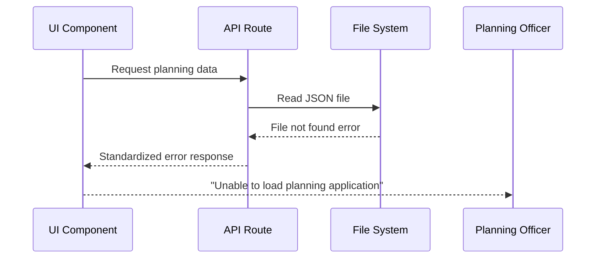

# Error Handling Strategy

## Error Flow


## Error Response Format
```typescript
interface ApiError {
  error: {
    code: string;
    message: string;
    details?: Record<string, any>;
    timestamp: string;
    requestId: string;
  };
}
```

## Frontend Error Handling
```typescript
export const SpatialErrorBoundary: React.FC<{ children: React.ReactNode }> = ({
  children
}) => {
  return (
    <ErrorBoundary
      fallback={<div>Map temporarily unavailable. Please refresh the page.</div>}
      onError={(error) => console.error('Spatial component error:', error)}
    >
      {children}
    </ErrorBoundary>
  );
};
```

## Backend Error Handling
```typescript
export function handleAPIError(error: any, res: NextApiResponse) {
  const errorResponse = {
    error: {
      code: error.code || 'INTERNAL_ERROR',
      message: error.message || 'An unexpected error occurred',
      timestamp: new Date().toISOString(),
      requestId: Math.random().toString(36)
    }
  };
  
  console.error('API Error:', errorResponse);
  return res.status(error.status || 500).json(errorResponse);
}
```
