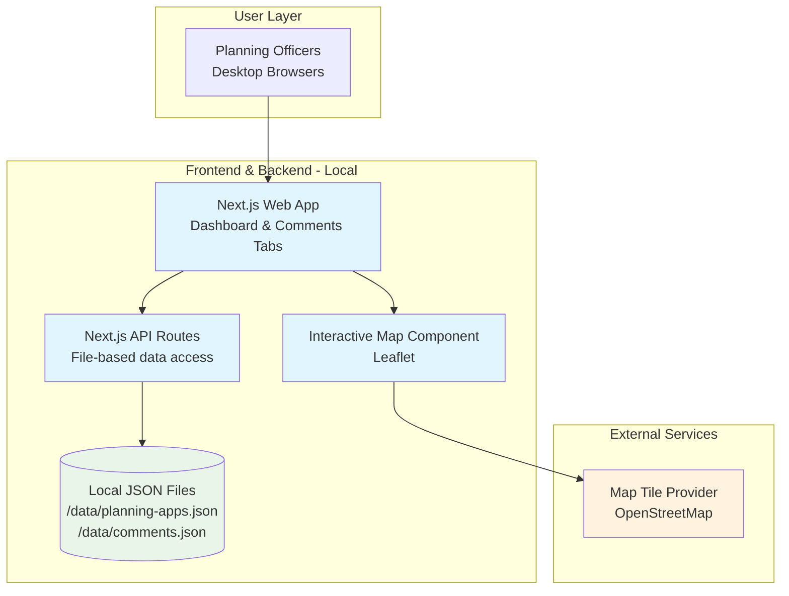

# High Level Architecture

## Technical Summary

The UK Planning Officer Neighbor Response Web App employs a **spatial-first fullstack architecture** built on Next.js 14+ with TypeScript, featuring a dual-tab interface optimized for planning officer workflows. The frontend leverages interactive mapping (Leaflet/Mapbox) as the primary navigation paradigm with real-time bi-directional synchronization between color-coded sentiment pins and filterable comment lists. The backend utilizes **file-based JSON data storage** with Next.js API routes serving geographic data and neighbor comments from editable local files, enabling rapid prototyping and easy data modification during development. **Local hosting** provides complete control over the development environment, while the **monorepo structure** ensures type-safe data consistency across spatial coordinate handling and planning workflow state management.

## Platform and Infrastructure Choice

For a **file-based prototype** with maximum development speed and data editability:

**Platform:** Local Development Environment (Next.js dev server)  
**Key Services:** Next.js (Frontend + API routes), Map tile provider (OpenStreetMap)  
**Deployment Host and Regions:** Local development server (localhost:3000), no external services required  
**Data Storage:** Local JSON files in `/data` directory, editable and version-controlled with the project

## Repository Structure

**Structure:** Simplified monorepo optimized for file-based prototype  
**Monorepo Tool:** npm workspaces (lightweight for prototype)  
**Package Organization:**
- `/apps/web` - Next.js application with API routes
- `/packages/shared` - TypeScript interfaces for planning data
- `/packages/ui` - Shadcn UI components  
- `/data` - **Editable JSON files** containing mock planning data
- `/packages/config` - Shared tooling configuration

## High Level Architecture Diagram

## Architectural Patterns

- **File-Based Data Layer:** JSON files as single source of truth with TypeScript interfaces - _Rationale:_ Maximum prototype flexibility, easy data editing during development, version-controlled test scenarios
- **Serverless API Routes:** Next.js API routes for file reading/writing operations - _Rationale:_ Eliminates external database complexity while maintaining API abstraction for future database migration
- **Static Site Generation + Dynamic APIs:** Static pages with dynamic data loading from local files - _Rationale:_ Fast loading times with editable data during development phase
- **In-Memory Caching:** File system caching for frequently accessed planning data - _Rationale:_ Maintains performance targets (sub-2 second loads) despite file-based approach
- **Spatial-First Navigation:** Interactive map as primary UI paradigm - _Rationale:_ Core PRD requirement unchanged by data storage approach
- **Bi-Directional Data Binding:** Real-time map-list synchronization via React state - _Rationale:_ Critical planning officer workflow requirement independent of backend architecture
